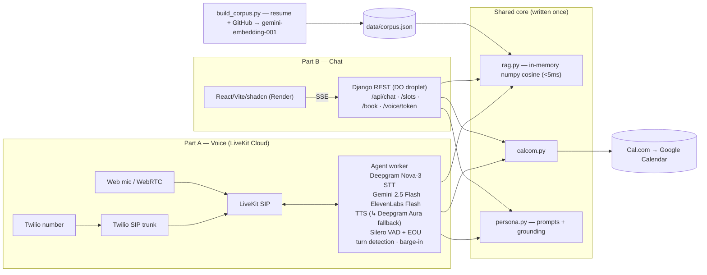

# Eeshu Yadav — AI Persona (Scaler AI Engineer Screening)

An AI persona of me you can **call**, **chat with**, and use to **book a real
interview** — end to end, no human in the loop. RAG-grounded over my real resume
and live GitHub (repo READMEs, languages, commits, merged PRs) and booking on a
real Cal.com calendar. No hardcoded answers.

- 📞 **Voice (phone):** **+1 (270) 612-3958**
- 🎙️ **Voice (web):** the **"Talk to the agent"** button on the chat site — browser mic → same agent over WebRTC (instant, works anywhere)
- 💬 **Chat:** https://eeshu-persona-chat.onrender.com
- 📄 **Eval report:** [one-page PDF](evals/eval_report.pdf) · [details](evals/report_template.md)
- ⚙️ **API:** https://162.243.231.158.sslip.io/api/health (always-on droplet, no cold starts)

## Eval results (20-case golden set · deployed backend · Gemini-2.5-Flash judge)

| Metric | Result |
|---|---|
| Groundedness | **95%** (19/20) |
| Hallucination | **5%** |
| Retrieval precision / recall | **0.685 / 0.962** |
| By type | factual 12/12 · unknown 3/3 · adversarial 4/4 · booking 0/1\* |

\*`book-1` is a judge-visibility artifact (the judge sees only answer text, not
that `get_availability` fired). Booking is confirmed working — a real Cal.com
booking was created. Reproduce: `python evals/run_chat_evals.py --api <url>`.

## Architecture



**Key decisions**
- **In-memory vector store** (precomputed embeddings, numpy cosine): ~120-chunk corpus → <5ms retrieval, zero infra, RAG runs in-process in the voice agent (no HTTP hop in the latency budget). Cost: redeploy to refresh.
- **Gemini-only** via its OpenAI-compatible endpoint (the `openai` client is used purely as HTTP transport). Free tier; resilience from **round-robin key rotation × model fallback** (`flash → flash-lite → 2.0-flash`), skipping any 429/403/5xx key.
- **ElevenLabs Flash + Deepgram Aura fallback** (`FallbackAdapter`) so TTS survives quota exhaustion.
- **Preemptive generation + VAD + EOU** → first audio before end-of-turn; barge-in safe (targets the <2s voice first-response).
- **Every specific claim via `search_background`** → auditable, no hardcoded facts.
- **Stateless chat** (client sends history) → nothing to leak, trivially scalable.

## Repo layout

```
shared/        rag.py · calcom.py · persona.py   (used by voice AND chat)
backend/       Django + DRF: SSE chat, slots, booking, voice token
voice-agent/   LiveKit Agents worker
frontend/      React (Vite + shadcn) chat UI + web-voice button
ingestion/     resume + GitHub → data/corpus.json
evals/         golden Q&A · judge eval runner · report
docs/          telephony-setup.md (Twilio ↔ LiveKit SIP)
docker-compose.yml   always-on backend deploy (Caddy auto-HTTPS via sslip.io)
```

## Setup

```bash
# 1. Corpus  (copy each .env.example → .env and fill first)
pip install -r backend/requirements.txt
GITHUB_TOKEN=... GEMINI_API_KEY=... python ingestion/build_corpus.py

# 2. Backend            cd backend && python manage.py runserver
# 3. Frontend           cd frontend && npm install && npm run dev
# 4. Voice agent        cd voice-agent && python agent.py download-files && python agent.py dev
# 5. Evals              python evals/run_chat_evals.py --api http://localhost:8000
```

**Deploy:** backend → any Docker host (`SITE_ADDRESS=<ip>.sslip.io docker compose up -d --build` gives an always-on HTTPS API with no domain); frontend → Render/Vercel static with `VITE_API_URL=<backend>`; voice agent → LiveKit Cloud (`lk agent deploy`); phone → [`docs/telephony-setup.md`](docs/telephony-setup.md).

## Cost

| Per 5-min voice call | Per chat session |
|---|---|
| Twilio ~$0.04 + Deepgram ~$0.03 + ElevenLabs ~$0.10 + Gemini $0 free (paid ~$0.04) ≈ **$0.20** | ~28k tokens = **$0** free tier (paid ~$0.015) |

Hosting: DO droplet (backend, always-on) + Render static (frontend) + LiveKit Cloud (agent).

## Honesty & safety

- `search_background` required before any specific claim; empty retrieval → explicit "I don't have that".
- Prompt-injection handling: instructions in user/retrieved text are treated as content, never directives (tested in `evals/golden_qa.json`, adv-1…4).
- Distinguishes my own projects from OSS contributions; bookings confirmed only on Cal.com API success.
- US number rationale: Indian (+91) DIDs are TRAI-regulated (KYC + days + rental), so there's no instant free Indian number — hence a standard US Twilio number, plus the free, instant web-voice button for India reachability.
