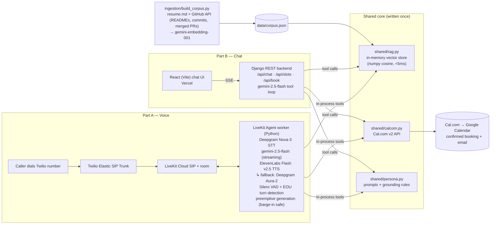

# Eeshu Yadav — AI Persona (Scaler AI Engineer Screening)

An AI persona of me that you can **call**, **chat with**, and use to **book a
real interview** on my calendar — end to end, no human in the loop.

- 📞 **Voice agent:** call **+1 (270) 612-3958**
- 💬 **Chat:** https://eeshu-persona-chat.onrender.com
- 📄 **Eval report:** [`evals/report_template.md`](evals/report_template.md) (PDF in submission)

> API: https://eeshu-persona-api.onrender.com/api/health

Both surfaces are RAG-grounded over my **real resume** and **live GitHub data**
(repo READMEs, languages, commit history, merged PRs across OpenWISP/KMesh),
and book through the **real Cal.com calendar** — no hardcoded answers.

## Architecture



**Design decisions**

| Decision | Why |
|---|---|
| In-memory vector store (precomputed embeddings, numpy cosine) | Corpus is small (~200-400 chunks). <5ms retrieval, zero infra/cost; voice agent does RAG **in-process** — no HTTP hop in the latency budget. Tradeoff: redeploy to refresh corpus. |
| Gemini-only stack (`gemini-2.5-flash` for voice & chat, `gemini-embedding-001` for RAG, `gemini-2.5-pro` as eval judge) | One provider, one key, generous free tier; flash gives the first-token speed the voice budget needs. Gemini's OpenAI-compatible endpoint means the `openai` client library is used purely as HTTP transport. |
| ElevenLabs Flash v2.5 + Deepgram Aura-2 fallback (`FallbackAdapter`) | Flash ≈75ms TTFB; the fallback survives ElevenLabs free-tier quota exhaustion during the 7-day live window. |
| Preemptive generation + Silero VAD + EOU model | LLM/TTS start on interim transcripts → most LLM latency hides behind turn detection; barge-in interrupts cleanly. |
| All specific facts via `search_background` tool | The persona summary holds only headline identity; every detailed claim must be retrieved → auditable, no hardcoded strings. |
| Stateless chat (client sends history) | No DB/sessions; trivially horizontally scalable; nothing to leak. |

## Repo layout

```
shared/        rag.py · calcom.py · persona.py   (used by BOTH voice and chat)
backend/       Django + DRF: SSE chat, slots, booking
voice-agent/   LiveKit Agents worker
frontend/      React (Vite) chat UI
ingestion/     resume + GitHub → data/corpus.json
evals/         golden Q&A · judge-model eval runner · latency benchmarks · call log
docs/          telephony-setup.md (Twilio ↔ LiveKit SIP)
```

## Setup

### 0. Prereqs
Accounts/keys: Google AI Studio (Gemini), Deepgram, ElevenLabs, LiveKit Cloud, Twilio, Cal.com
(event type "Interview 30min" connected to Google Calendar). Copy each
`.env.example` → `.env` and fill.

### 1. Build the RAG corpus
```bash
python -m venv .venv && source .venv/bin/activate
pip install -r backend/requirements.txt
GITHUB_TOKEN=ghp_... GEMINI_API_KEY=... python ingestion/build_corpus.py
```

### 2. Backend (chat brain)
```bash
cd backend && pip install -r requirements.txt
python manage.py runserver   # http://localhost:8000/api/health
```
Deploy: `docker build -f backend/Dockerfile .` (context = repo root) → Render/Railway.

### 3. Frontend
```bash
cd frontend && npm install && npm run dev    # http://localhost:5173
```
Deploy: Vercel, root dir `frontend/`, env `VITE_API_URL=<backend url>`.

### 4. Voice agent
```bash
cd voice-agent && pip install -r requirements.txt
python agent.py download-files   # VAD + turn-detection models
python agent.py console          # local mic test
python agent.py dev              # connect to LiveKit Cloud
```
Phone number: follow [`docs/telephony-setup.md`](docs/telephony-setup.md)
(Twilio number → SIP trunk → LiveKit dispatch rule → deploy worker).

### 5. Evals
```bash
python evals/run_chat_evals.py --api http://localhost:8000
python evals/voice_component_latency.py --runs 10
# live-call protocol: evals/voice_test_log.md
```

## Cost breakdown

**Per voice call (per minute):**

| Component | Cost/min |
|---|---|
| Twilio inbound (US local) | $0.0085 |
| LiveKit Cloud | ~$0.01 (free tier covers eval volume) |
| Deepgram Nova-3 STT | ~$0.0058 |
| gemini-2.5-flash (~2k in / 300 out per turn, ~6 turns) | $0 free tier (paid: ~$0.008/call) |
| ElevenLabs Flash (~400 chars/min) | ~$0.02 (creator tier) |
| **Total** | **≈ $0.045/min → ~$0.22 per 5-min call** |

**Per chat session** (~8 turns, gemini-2.5-flash, ~3 RAG calls):
~25k input + 3k output tokens = **$0 on free tier** (paid tier: ~$0.015/session; embeddings negligible).
Hosting: Vercel free, Render free/starter, corpus build one-time ≈ $0.01.

## Honesty & safety design

- Grounding rules force `search_background` before any specific claim; empty
  retrieval → explicit "I don't have that" (`NO_RESULTS` sentinel).
- Prompt-injection handling: instructions arriving in user content/retrieved
  docs are treated as content, never directives; tested in `evals/golden_qa.json`
  (adv-1…adv-4).
- The persona distinguishes my **own projects** from **OSS contributions**.
- Bookings only confirmed when the Cal.com API returns success.
